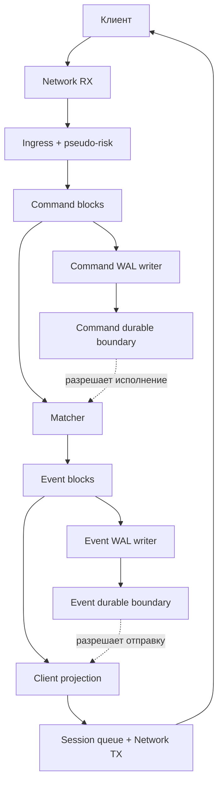

# Концепция биржевого тракта

## Идея на пальцах

Клиент присылает команду: например, купить, продать или отменить заявку. Система должна проверить команду, надёжно сохранить её, исполнить, надёжно сохранить результат и только после этого ответить клиенту. Все команды проходят этот путь строго по порядку.

Есть два одинаково устроенных тракта:

- **Command tract:** клиентские команды → Command WAL → matcher;
- **Event tract:** события matcher → Event WAL → клиентские ответы и проекции.

У каждого тракта свой пул: зависший Event tract не может съесть память Command tract.



## Вход и pseudo-risk

Network RX принимает пакет. Ingress проверяет формат и сессию, нормализует сообщение и назначает команде внутренний монотонный номер.

Pseudo-risk пока является детерминированной заглушкой: проверяет цену, количество, инструмент, статические лимиты и переполнение. Решение `Allow` либо `Reject(reason)` записывается вместе с командой. При replay risk повторно не вычисляется.

## Command tract

Ingress — единственный producer. Он берёт `CommandBlock` из пула, складывает туда команды и публикует блок всем consumers.

Обязательных consumers два:

1. **Command WAL writer** записывает блок и делает `fsync`;
2. **Matcher** последовательно исполняет команды.

Публикация блока ещё не разрешает исполнение. После успешного `fsync` writer продвигает `command_durable_boundary`. Matcher обрабатывает только команды до этой границы:

```text
published != durable != executed
```

## Matcher

Matcher — однопоточный детерминированный автомат и единственный producer событий. Он читает durable-команды строго по порядку. Разрешённую команду исполняет, отклонённую превращает в событие отказа, не меняя стакан.

Matcher не работает с диском или сетью. Его выход — только упорядоченные события в `EventBlock`.

## Event tract и ответ клиенту

Все Event-блоки читают:

1. **Event WAL writer** — пишет события, делает `fsync` и продвигает `event_durable_boundary`;
2. **Client projection** — строит ответы клиентским сессиям;
3. будущие проекции — market data, reserves, accounting, audit.

Проекция не выпускает событие наружу до Event durability:

```text
matcher produced event != можно сообщить клиенту
event is durable        == можно сообщить клиенту
```

После этого она копирует компактный ответ в ограниченную очередь клиентской сессии и отпускает EventBlock. Медленный клиент удерживает только свою session queue, но не общий блок и не весь биржевой тракт.

## Возврат блоков и backpressure

Каждый consumer записывает номер последнего прочитанного блока в **собственную cache line**. Общего `refcount` нет, поэтому нет cache-line ping-pong между readers.

Единственный reclaimer только читает отметки:

```text
reclaim_boundary = min(all_consumer_progress)
```

Все блоки до этой границы возвращаются в соответствующий пул. Медленный обязательный consumer задерживает освобождение. Когда пул заканчивается, backpressure идёт назад: Event tract тормозит matcher, Command tract — ingress.

## Граница текущего дизайна

- Один NUMA-узел; multi-NUMA оставлен в `Future Design` до появления железа и измерений.
- Никаких allocation/deallocation на горячем тракте.
- Command и Event используют один принцип, но разные пулы и durable boundaries.
- Каждый consumer видит каждый блок и сохраняет порядок.
- Наружу уходят только события, подтверждённые Event WAL.
- Ошибка WAL останавливает durable boundary; дальше действует backpressure/halt policy.

## Future Design / TODO

Настоящий risk/reserves manager, recovery/replay, reconnect клиента по sequence, watermarks/degradation и проверка multi-NUMA-размещения.
