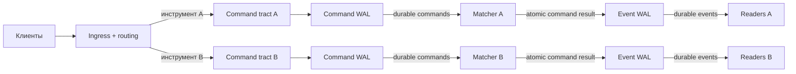

# Концепция биржевого тракта

## Картинка за 30 секунд

Ingress принимает клиентские команды и распределяет их по независимым трактам
инструментов. У каждого инструмента свой последовательный путь:

```text
клиентская команда
    -> durable Command WAL
    -> Matcher
    -> атомарный результат команды
    -> durable Event WAL
    -> внешние читатели
```

Главное правило:

> Сначала надёжно сохраняем вход, затем исполняем. Сначала надёжно сохраняем
> результат, затем разрешаем внешнему миру его увидеть.



## Что гарантирует один тракт

Для каждого инструмента существует один ordered command stream и один владелец
matching state — однопоточный детерминированный Matcher.

Matcher получает только durable-команды. Он не знает, как устроены диск, WAL,
`fsync`, сеть или потоки исполнения.

Результат одной команды логически атомарен: события одной команды образуют одну
упорядоченную группу, внутрь которой не вклинивается результат другой команды.
Размещение этой группы в блоках и обеспечение durability находятся за границей
Matcher.

После подтверждения Event durability обязательство критического тракта
выполнено. Дальнейшая доставка клиентам и другим читателям не является работой
Matcher.

## Два независимых bounded-тракта

Внутри инструментального тракта есть два отдельных ограниченных пула:

- Command pool обслуживает путь от Ingress до Matcher;
- Event pool обслуживает путь от Matcher до Event WAL.

Event tract не может занять память Command tract. Изоляция памяти не отменяет
backpressure: остановка нижнего участка последовательно тормозит верхние.

```text
Event WAL временно не успевает
    -> заканчиваются свободные Event blocks
    -> Matcher ждёт
    -> Matcher перестаёт освобождать Command blocks
    -> заканчиваются свободные Command blocks
    -> Ingress отказывает в новых командах этого инструмента
```

Остальные инструментальные тракты продолжают работать.

## Backpressure и Fatal

Нехватка свободных блоков — штатный backpressure. Система не нарушает ordering и
не использует неограниченную память, а перестаёт принимать новые команды
затронутого инструмента.

Ошибка WAL — другое состояние. Это нарушение гарантии durability, поэтому
соответствующий инструментальный тракт становится недоступен. Ingress отказывает
по этому инструменту, не останавливая остальные инструменты.

Важно различать:

- Ingress rejection: команда не была принята и не попала в Command WAL;
- Matcher rejection: команда была принята, стала durable и получила
  детерминированный бизнес-результат.

## Вход и pseudo-risk

Ingress проверяет формат и сессию, нормализует команду, выполняет текущие
детерминированные проверки и выбирает инструментальный тракт.

Pseudo-risk пока является детерминированной заглушкой: проверяет цену,
количество, инструмент, статические лимиты и переполнение. Решение `Allow` либо
`Reject(reason)` сохраняется вместе с принятой командой и при replay повторно не
вычисляется.

## Некритичные читатели

Client projection пока не является критичной для Matcher. Market data,
accounting, analytics и другие некритичные читатели получают отдельные струны
данных, создаваемые оркестратором биржи.

Такая струна не должна останавливать Matcher. Отставший читатель может потерять
производительность и восстановиться через собственный snapshot/recovery path,
но его состояние не создаёт backpressure в matching tract.

Конкретное устройство этих струн и политика медленного читателя пока не входят
в эту концепцию.

## Recovery

Command WAL является источником истины для команд. Matching state (стакан),
command state и event state имеют snapshot/recovery-механизмы.

Точная роль Event WAL в общей модели восстановления пока не определена. В
частности, ещё предстоит решить, какие event-факты являются каноническими и как
сводятся snapshots разных частей системы.

## Граница текущей концепции

- один NUMA-узел;
- никаких allocation/deallocation на горячем тракте;
- отдельный ordered tract для каждого инструмента или его partition;
- Matcher видит только durable-команды;
- наружу разрешено показывать только durable-события;
- Command и Event используют разные bounded-пулы;
- backpressure и WAL fatal изолируются по инструментальному тракту;
- детали блоков, cursors, reclamation и дополнительных струн будут определяться
  реализацией и измерениями.

## Пока открыто

- точная роль Event WAL в recovery;
- согласование command, matcher и event snapshots;
- политика дополнительных читателей и их восстановления;
- watermarks и режимы degradation;
- partitioning инструментов и multi-NUMA после появления требований и
  измерений;
- настоящий risk/reserves manager.
