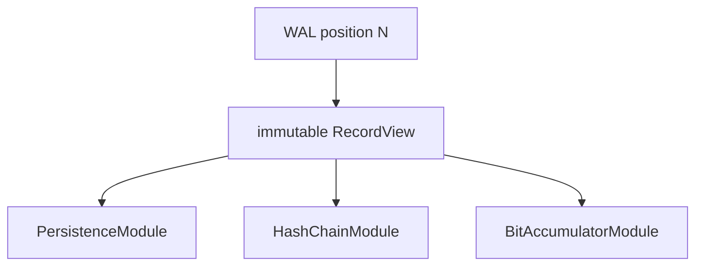
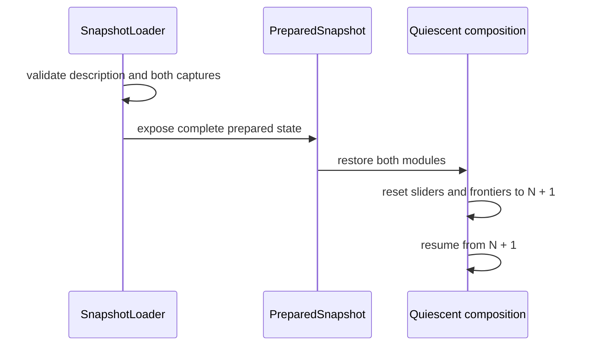

# Demo 006: простое snapshot-приложение

## Назначение

Demo 006 показывает, как построить snapshot-приложение поверх одной
ограниченной WAL-струны. Несколько модулей последовательно обрабатывают одни и
те же записи, публикуют собственный прогресс и совместно создают согласованный
snapshot состояния приложения.

Это инженерное демо, а не отдельный сервер или готовый биржевой сервис. Каталог
содержит библиотеку прикладных модулей, snapshot-код и исполняемые тестовые
композиции. Внешний код отвечает за цикл исполнения, расписание стадий и
политику ожидания.

Первый реализованный тракт выглядит так:


Для него всегда должен выполняться инвариант:

```text
tail <= BitF <= HashF <= DurableF <= head
```

## Основная идея

WAL одновременно служит ограниченным runtime-хранилищем и общей упорядоченной
строкой данных. У неё есть только две собственные специальные границы:

- `head` — исключительная граница опубликованных producer-ом позиций;
- `tail` — исключительная граница освобождённых позиций, память которых можно
  использовать повторно.

`DurableF`, `HashF` и `BitF` принадлежат соответствующим слайдерам. Они не
являются внутренними границами WAL.

Каждая запись хранится в WAL один раз. `PersistenceSlider`, `HashChainSlider` и
`BitAccumulatorSlider` получают read-only view одной и той же абсолютной
позиции. Между стадиями нет копий записи, дополнительных очередей и передачи
владения payload.



Фронтир — exclusive end. Значение `X` означает, что стадия полностью обработала
диапазон `[0, X)`. После успешной обработки позиции `N` слайдер может
опубликовать `N + 1`.

Слайдер читает WAL и upstream-фронтир, владеет своей текущей абсолютной позицией
и единолично публикует собственный фронтир. Он вызывает конкретный модуль
синхронно и не содержит worker thread, polling loop, ожидание, файловый snapshot
I/O или runtime registry.

Композиция статическая: типы модулей и порядок стадий известны при компиляции.
Виртуальная диспетчеризация для тракта не используется.
Названия `HashChainSlider` и `BitAccumulatorSlider` обозначают конкретные
типизированные экземпляры общего шаблона `wal::Slider`, а не отдельные классы.

## Координаты записи

| Понятие | Назначение |
|---|---|
| Абсолютная позиция | Логический адрес записи в общей WAL-струне |
| Физическая sequence | Идентификатор записи в persisted WAL |
| Ring slot | Внутреннее место хранения `position % capacity` |

Публичные контракты используют абсолютную позицию или physical sequence. Номер
ring slot наружу не передаётся. View позиции доступен, только пока позиция уже
опубликована через `head` и ещё не освобождена через `tail`.

## Прикладные записи

[`record.hpp`](../include/fexma/snapshot_demo/record.hpp) задаёт строгий
64-байтовый payload версии 1:

- `Data` содержит 48 байт прикладных данных;
- `SaveSnapshot` содержит идентификатор поколения;
- поля имеют фиксированное little-endian представление;
- неизвестная версия, kind, ненулевые зарезервированные байты и неверный размер
  отклоняются.

Для `SaveSnapshot(N)` идентификатор поколения обязан совпадать с абсолютной
позицией записи `N`. Благодаря этому snapshot, состояния модулей и точка
возобновления используют одну координату.

## Модули состояния

[`HashChainModule`](../include/fexma/snapshot_demo/hash_chain.hpp) поддерживает
детерминированную 64-битную цепочку над предыдущим digest, абсолютной позицией,
physical sequence, размером и байтами payload. Это контроль согласованности и
порядка, а не криптографический аутентификатор.

[`BitAccumulatorModule`](../include/fexma/snapshot_demo/bit_accumulator.hpp)
поддерживает общее число установленных битов и order-sensitive rolling fold над
идентификаторами записи и её байтами.

Оба модуля принимают только позицию, равную их `processed_end`. Gap, повтор или
перестановка переводят модуль в терминальное failed-состояние. Корректный input
обрабатывается синхронно и без аллокаций.

## Живое продвижение

Persistence является первой обычной стадией. Она записывает доступный batch в
физический WAL и публикует `DurableF` только после успешной синхронизации.
HashChain не может пройти дальше `DurableF`, а BitAccumulator — дальше `HashF`.

Типичный внешний orchestration step имеет следующий смысл:

```cpp
persistence_slider.process_available();
hash_slider.process_available();
bit_slider.process_available();

// После завершения всех пользователей заимствованных view:
wal.reclaim(bit_frontier.reader().acquire());
```

Порядок и частота вызовов являются политикой композиции. Стадии могут
продвигаться с разной скоростью, пока сохраняется общий инвариант фронтиров.

`tail` нельзя продвигать вслед за `HashF`: HashChain может уже закончить
позицию, которую BitAccumulator ещё читает. Только `BitF`, фронтир последнего
обязательного модуля, разрешает освободить память этой линейной композиции.

## Семантика snapshot

`SaveSnapshot(N)` проходит через те же стадии и в том же порядке, что и обычная
запись. Каждый stateful-модуль выполняет следующую последовательность:

```text
process record N
-> StateAfter(N)
-> immutable Capture@Module@N
-> successful module completion
-> slider publishes exclusive frontier N + 1
```

Snapshot включает эффект самой управляющей записи. После восстановления первой
необработанной позицией является `N + 1`.

У каждого модуля есть один слот pending capture. Модуль может продолжать
обрабатывать обычные записи, пока capture остаётся неизменным. Если до его
освобождения встречается следующий `SaveSnapshot`, модуль возвращает retryable
failure, не меняет состояние для этой позиции и не публикует её.

[`CaptureGenerationCoordinator`](../include/fexma/snapshot_demo/capture_generation.hpp)
принадлежит композиции. Он собирает поколение только после появления capture от
обоих модулей и проверяет совпадение generation id, абсолютной позиции,
exclusive processed end, physical sequence и границ captured state.

До успешного сохранения полное поколение и оба module capture остаются заняты.

## Публикация snapshot

[`SnapshotSink`](../include/fexma/snapshot_demo/snapshot_sink.hpp) получает уже
собранное immutable-поколение. Для поколения `N` он создаёт:

```text
snapshot-root/
└── snapshot-N/
    ├── hash_chain.snapshot          64 bytes
    ├── bit_accumulator.snapshot     72 bytes
    └── snapshot.description        152 bytes
```

Файлы имеют фиксированные little-endian схемы. Description содержит identity
WAL и композиции, поколение, позицию, sequence, идентификаторы и версии схем
модулей, размеры файлов и CRC32.

Публикация выполняется поэтапно:

1. Создаётся каталог `snapshot-N.pending`.
2. Записываются и синхронизируются оба module-файла.
3. Записывается и синхронизируется `snapshot.description.pending`.
4. Description переименовывается в окончательное имя.
5. Staging-каталог переименовывается в `snapshot-N`.

Только каталог `snapshot-N` считается опубликованным. Существующее поколение не
перезаписывается. Ошибка записи, flush, sync или publication сохраняет полное
поколение и module capture для повторной попытки. Освобождение происходит после
успешной публикации.

Sink отдельно сообщает длительность capture модулей, сборки поколения,
сериализации, записи, flush, fsync, публикации и полного вызова.

## Загрузка и восстановление

[`SnapshotLoader`](../include/fexma/snapshot_demo/snapshot_loader.hpp) загружает
только явно указанное опубликованное поколение. Он не выбирает автоматически
последний каталог и не рассматривает `.pending` как кандидата.

До выдачи `PreparedSnapshot` loader проверяет CRC и структуру description,
identity, поколение и границу, обязательные module id и schema version, точные
размеры и CRC module-файлов, каноническое декодирование и согласованность обоих
capture. Проверка выполняется в изолированном объекте: ошибка любого участника
не меняет живую композицию.

[`restore_snapshot_quiescent()`](../include/fexma/snapshot_demo/bootstrap.hpp)
применяет подготовленное состояние только в quiescent-режиме, когда слайдеры и
читатели состояния остановлены. После успеха оба модуля, обе позиции слайдеров и
оба фронтира устанавливаются в `N + 1`.



Bootstrap-тест доказывает эквивалентность:

```text
continuous process [0, M)
==
restore snapshot@N + process [N + 1, M)
```

## Структура каталога

```text
exchange/snapshot_demo/
├── include/fexma/snapshot_demo/
│   ├── record.hpp                 application payload codec
│   ├── hash_chain.hpp             HashChain state and capture
│   ├── bit_accumulator.hpp        BitAccumulator state and capture
│   ├── capture_generation.hpp     full-generation coordinator
│   ├── snapshot_format.hpp        fixed snapshot schemas
│   ├── snapshot_sink.hpp          durable publication API
│   ├── snapshot_loader.hpp        isolated validation and loading
│   └── bootstrap.hpp              all-or-nothing quiescent restore
├── src/
│   ├── snapshot_format.cpp        serialization and decoding
│   ├── snapshot_sink.cpp          file write, sync and publication
│   └── snapshot_loader.cpp        file loading and validation
├── tests/
│   ├── test_stateful_pipeline.cpp
│   ├── test_snapshot_semantics.cpp
│   ├── test_snapshot_sink.cpp
│   ├── test_bootstrap_restore.cpp
│   ├── test_progress_and_repeated_snapshots.cpp
│   └── test_large_capture.cpp
├── doc/README.md
├── CMakeLists.txt
└── README.md
```

Общие механизмы `WalCore`, `Progress`, `Slider`, `PersistenceModule` и
`PersistenceSlider` находятся в [`exchange/wal`](../../wal). Snapshot-приложение
использует их как нижележащий механизм и не дублирует WAL-хранилище.

## Проверяемые свойства

| Тест | Основные свойства |
|---|---|
| `test_stateful_pipeline` | Полный тракт, разные скорости стадий, wraparound, порядок и reclamation |
| `test_snapshot_semantics` | Codec, `StateAfter(N)`, immutable capture, coordinator и backpressure |
| `test_snapshot_sink` | Полная публикация, retry после I/O failure и запрет перезаписи |
| `test_bootstrap_restore` | All-or-nothing validation, corruption cases и suffix equivalence |
| `test_progress_and_repeated_snapshots` | Нарушения фронтиров, преждевременный tail и повторные поколения |
| `test_large_capture` | Синтетические capture 1, 10, 100 и 500 MiB |

`test_large_capture` имеет CTest label `stress`, выполняется последовательно и
имеет timeout 300 секунд. Максимальный сценарий одновременно держит примерно
500 MiB live-state, 500 MiB immutable capture и 4 MiB read buffer. Он является
тестовым harness и не расширяет production snapshot-схемы.

## Сборка и запуск

Основной baseline проекта — Windows, Visual Studio 2022, x64, C++20, Release:

```powershell
cmake --preset windows-msvc
cmake --build --preset windows-msvc-release
ctest --preset windows-msvc-release
```

Библиотечная CMake-цель приложения называется `fexma::snapshot_demo`.

Только тесты snapshot demo:

```powershell
ctest --preset windows-msvc-release -R "^test_snapshot_demo_"
```

Отдельный stress-тест:

```powershell
ctest --preset windows-msvc-release -R "^test_snapshot_demo_large_capture$"
```

## Границы первого этапа

В Demo 006 первого этапа отсутствуют:

- Matcher, OrderBook, Risk и Reserve;
- Event WAL;
- runtime registry и виртуальная маршрутизация модулей;
- отдельные очереди между стадиями;
- execution loop или wait policy внутри слайдера;
- live restore одновременно с работающими слайдерами;
- автоматический выбор «последнего» snapshot.

Эти ограничения сохраняют демо небольшим и позволяют отдельно проверить общую
WAL-струну, владение фронтирами, согласованный capture и bootstrap restore.
